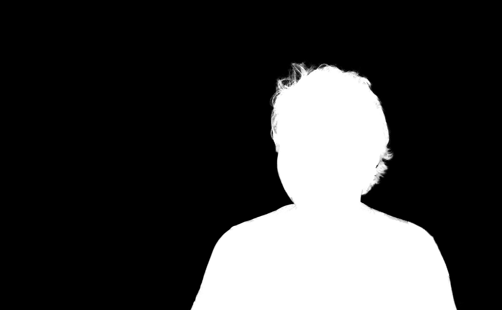

# Image Composition with Color Adjustment 

Implementation of Bernardo Henz's paper [**Independent Color-Channel Adjustment for Seamless Cloning Based on Laplacian-Membrane Modulation**](https://bernardohenz.github.io/projects/independent_color_adjustment/index.html) (The source code language is matlab).

## Requirements
python 3.6+

## Usage
```bash
python demo.py
```

## Results
Source Portrait

Alpha Mask

Composite Image (w = (0.70, 0.82, 0.84))

